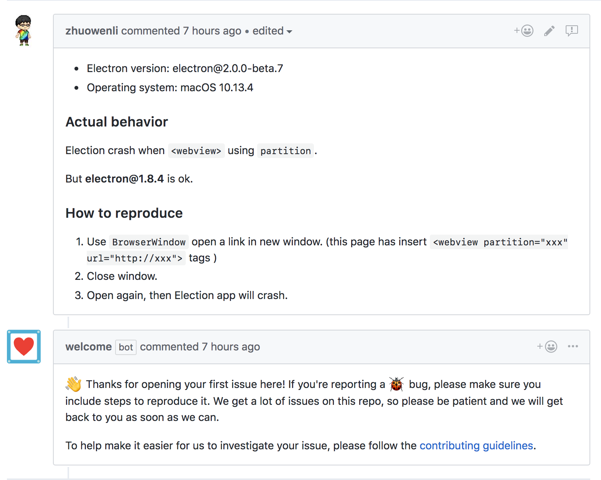

---

# Jake Feinler

---

# @zeke

---

---

---

---

---

# GitHub Flow

---

# GitHub Community Checklist

---

# Issue Templates

---

---

# Generous Permissions

---

---

# Heroku Review Apps

---

# Demonstrable Pull Requests

---

# Continuous Deployment

--- 

**Semantic Versionsing** (SemVer) is a simple set of rules that dictate how version numbers are assigned and incremented.
 
---

`major.minor.patch`

`breaking.feature.fix`

---

**Semantic Release** is a tool for automated releases: let humans write meaningful commit messages and leave versioning up to the machines.

---

Semantic Release removes the connection between human emotions and version numbers.

---

---

---

---

# Bots!

---

---

---

---

---

--- 

---

# URLs

- github.com/your/repo/community
- github.com/apps
- probot.github.io
- github.com/octokit
- github.com/zeke/github-constellation-la-talk

---

---

fin.

probot linter